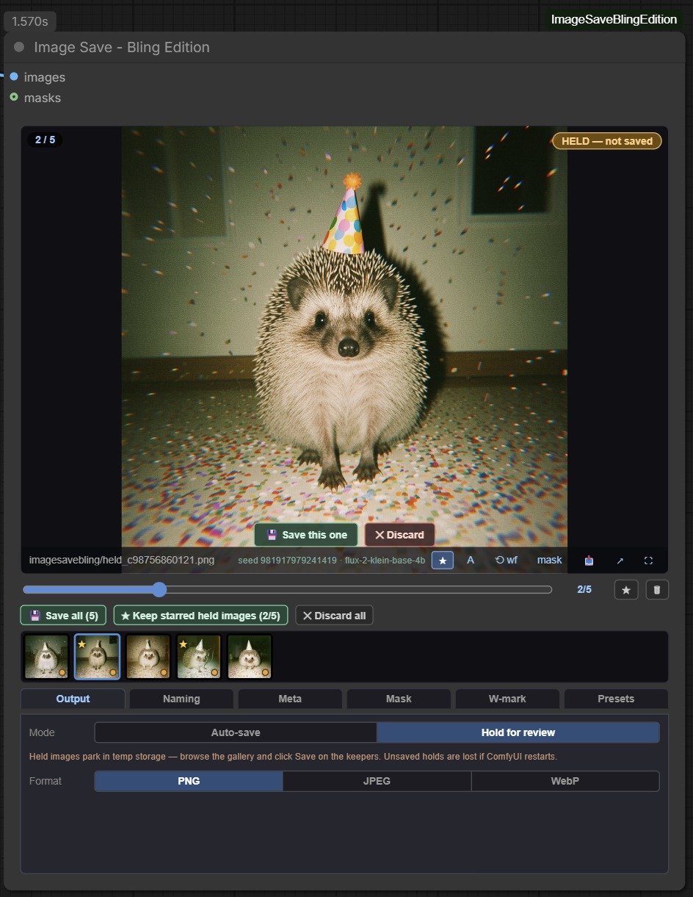
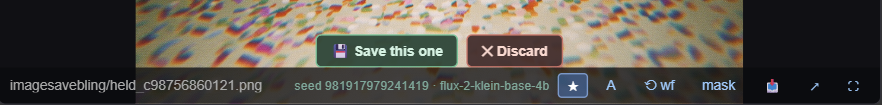
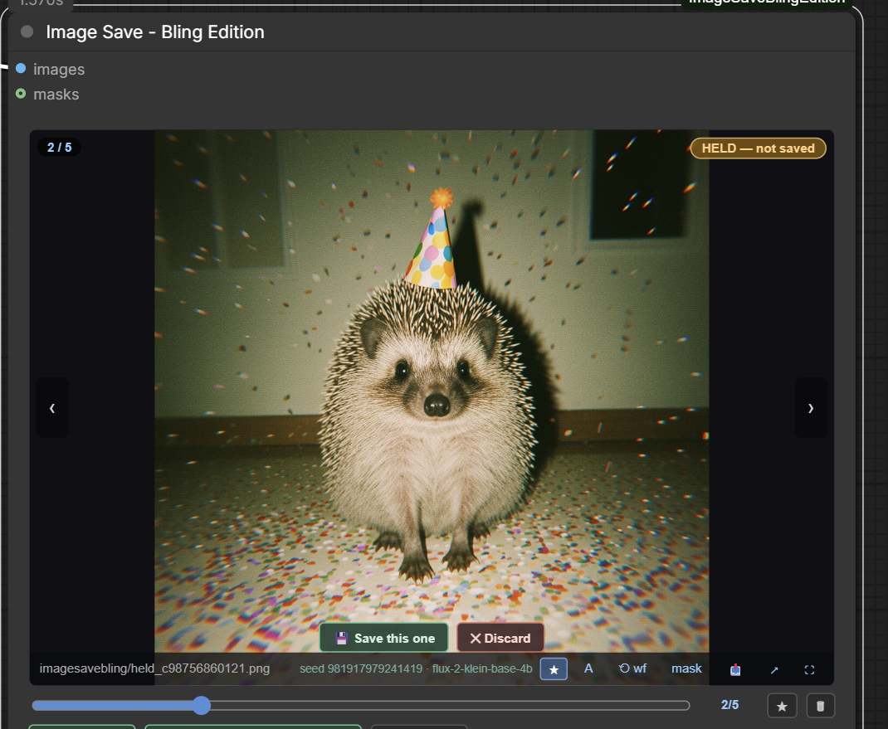
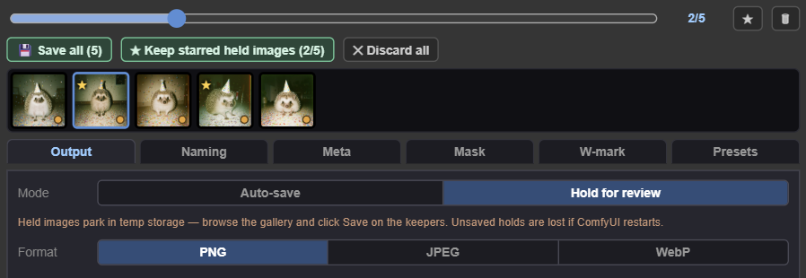
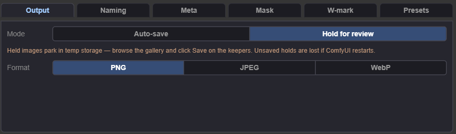
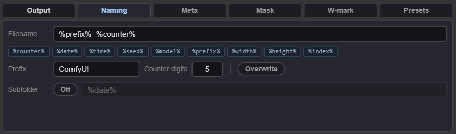
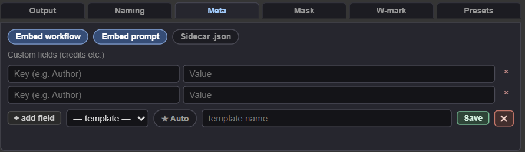
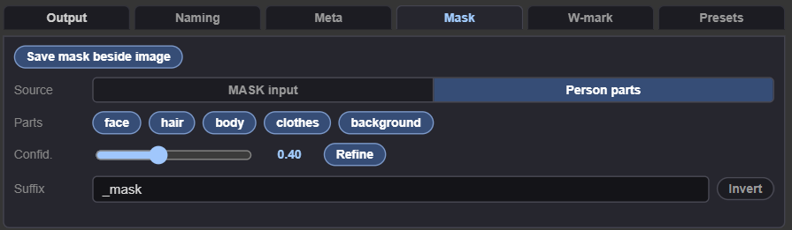
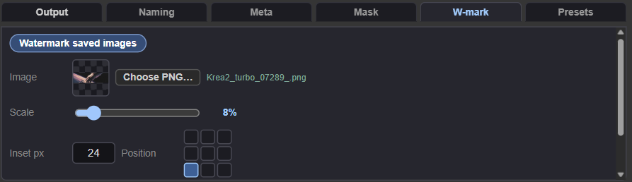
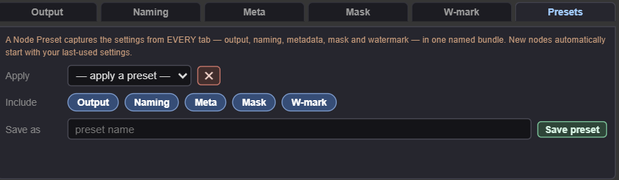

# Image Save - Bling Edition

**The save node for ComfyUI reimagined.** A **session gallery on the node** that survives restarts, **hold-for-review triage** that keeps your output folder clean, and **one-click workflow recovery** from any image — plus formats, metadata, credits, auto mask sidecar images (mediapipe), watermarks, a save-to-comfy-inputs button and more, all remembered between sessions.

<a href="https://buymeacoffee.com/lorasandlenses"></a>

## What it does in one screen



That's the whole output side of your workflow. No preview node, no separate save node, no digging through the output folder to find "the good one from an hour ago" — it's in the filmstrip, with its seed, and its workflow is one click away.

## Why you'd want it

The standard flow is: `Preview Image` to look, `Save Image` to keep, and a growing output folder of everything you ever queued — good, bad, and duplicate. Finding the settings behind last hour's best image means dragging files back in one at a time. Bling Edition collapses all of it into one node:

**Browse — the session gallery**

- Every executed image lands in the **filmstrip + viewer** on the node. Scrub the slider, click thumbnails, flip with the arrows.
- **Session recovery**: the gallery is rebuilt after a page reload *and* after a ComfyUI restart. Each node keeps a history manifest on the server, tied to the workflow it lives in — reopen the workflow tomorrow and the gallery is still there.
- **Fullscreen review**: click the image for a lightbox — scroll zooms around the cursor, drag pans, double-click flips fit ↔ 1:1 pixels. Arrows walk the gallery without leaving it. Whichever of fit or 1:1 you last double-clicked to sticks — across images, across reopening the lightbox, even across a ComfyUI restart — until you double-click again.
- **A/B compare**: pin any image as **A**, then hold the `A⇄B` button (or `C` in fullscreen) on any other image to flip between them. The fastest honest way to judge two seeds.
- **"What made this?"** — every entry shows its **seed and model**, and the **⟲ wf** button loads the exact workflow that produced it straight into the canvas (two-click confirm — it replaces the current graph, that's the point).
- **📥 Save to inputs** — copy any gallery image into ComfyUI's `input/` folder under a name you type, ready for a Load Image node (Load Image lists refresh automatically). Generate → review → feed the keeper straight back into your next workflow.
- **★ filter** — stars aren't just for triage: star anything, held or saved, and toggle the **★** button beside the slider to scrub only your starred images. Stars live in the manifest, so your bookmarks survive reloads and restarts.

Every image carries its own action bar — name, seed, model, star, A/B pin, workflow restore, mask toggle, save-to-inputs, open full size, fullscreen:



**Triage — Hold-for-review (the killer feature)**

- Flip Output mode to **Hold for review** and images park in temp storage instead of your output folder.
- Generate a batch, flip through fullscreen, tap **S** to star the keepers, then hit **★ Keep starred held images** — starred images save through your naming/format/metadata rules, the rest are discarded. One click, clean output folder.
- Or go one at a time (**Save this one** / **Discard**), or **💾 Save all**, or **✕ Discard all**. Destructive buttons arm on first click and fire on the second. Save buttons spin and disable themselves while the write is in flight, so an impatient second click can't fire it twice.
- Stars survive reloads (they live in the manifest), and a held image keeps its star when saved.
- **Everything is decided at save time, not generation time.** Format, naming, metadata, mask, watermark, save root — whatever the panel shows *when you click Save* is what gets used, even if you change settings after generating. Hold a batch, tweak the naming pattern or flip on a watermark, then commit — it applies to every held image you save from that point on, regardless of what was set when they were generated.

Held images wear their state on the viewer — the amber badge and per-image save/discard:



The bulk triage row appears whenever holds exist — starred thumbnails show a ★, held ones an amber dot:



**Save — formats, names, metadata**

- **PNG / JPEG / WebP** with a quality slider and lossless WebP. JPEG/WebP embed the workflow in EXIF using the same convention core ComfyUI uses, so **drag-to-restore keeps working outside PNG**.
- **Save root**: point the node at any folder on disk instead of ComfyUI's `output` — leave it blank and nothing changes. Click **Browse…** for a folder picker built into the node; it walks the ComfyUI server's own filesystem rather than opening a real OS dialog (browsers won't hand a page an absolute path, native or otherwise), but it gets you the same click-through-folders experience. Naming, subfolders, and everything else in this list work exactly the same underneath whichever root is set.
- **Token filenames and subfolders**: `%counter%`, `%date%` (custom formats like `%date:yyyy-MM-dd%`), `%time%`, `%seed%`, `%model%`, `%prefix%`, `%width%`, `%height%`, `%index%` — chips insert at your cursor in whichever box you're editing, and a live example shows the exact path you'll get. Subfolders toggle on/off; **overwrite** replaces same-named files instead of counting up.
- **Metadata control**: embed or strip workflow and prompt independently, write a **sidecar `.json`** for clean files that are still recoverable, and add **custom fields** (Author, Copyright, anything — they land in the proper EXIF tags). Save field sets as **credit templates**; star one as **Auto** and every new node preloads it.
- **Mask beside the image**: pipe a MASK in, or generate an automatic **person mask** (face / hair / body / clothes / background — mediapipe). The viewer's *mask* button flips between image and mask.
- **Watermark**: upload a PNG once and every save composites it — scaled to a **proportion of the image width**, positioned on a **3×3 grid**, inset in **hard pixels**, with opacity. Held images stay clean; the watermark lands when you commit them, so you can decide after generating.

**Never set it up twice**

- **Everything remembers last use** — a new Bling Edition node starts with whatever format, naming, metadata, mask and watermark settings you used last, not factory defaults.
- **Node Presets** (last tab) save **all tabs** as one named bundle, with per-group include toggles — a "client work" preset can carry watermark + credits and leave your naming alone. Applying a preset only touches the groups it captured.

## Install

```
cd ComfyUI/custom_nodes
git clone https://github.com/shootthesound/ComfyUI-ImageSaveBlingEdition
```

ComfyUI Manager installs the one dependency (mediapipe, for the automatic person mask) for you. For a manual git install:

```
pip install -r ComfyUI-ImageSaveBlingEdition/requirements.txt
```

If mediapipe is missing for any reason, everything except the automatic mask still works — the Mask tab will tell you. Mask models auto-download to `models/mediapipe/` on first use.

## Quick start

1. Add **Image Save - Bling Edition** (category: *image*) and wire an IMAGE into it. Queue — the image appears in the gallery and saves with your current settings.
2. Click the image for **fullscreen review**. Scroll to zoom, arrows to flip through.
3. **Output tab** → switch mode to **Hold for review**. Queue a few generations, star the keepers with `S`, hit **★ Keep starred held images**.
4. **Naming tab** → click token chips into the filename box and watch the live example line build your path.
5. **Meta tab** → set your credit fields once, **Save** them as a template, hit **★ Auto** so every future node carries them.
6. **W-mark tab** → upload your logo PNG, set scale/position/inset, done — every save is branded.
7. **Presets tab** → save the whole setup under a name you'll reuse.

## The tabs

Click a tab to expand it:

<details open>
<summary><b>Output</b> — Auto-save / Hold for review · PNG / JPEG / WebP · quality · lossless WebP · save root + folder Browse…</summary>
<br>

</details>

<details>
<summary><b>Naming</b> — filename pattern + token chips · prefix · counter digits · overwrite · subfolder on/off + pattern · live example</summary>
<br>

</details>

<details>
<summary><b>Meta</b> — embed workflow · embed prompt · sidecar .json · custom fields · credit templates + ★ Auto</summary>
<br>

</details>

<details>
<summary><b>Mask</b> — on/off · MASK input / person parts · confidence · refine · invert · suffix</summary>
<br>

</details>

<details>
<summary><b>W-mark</b> — on/off · PNG upload · scale (% of image width) · inset px · 3×3 position · opacity</summary>
<br>

</details>

<details>
<summary><b>Presets</b> — apply / save / delete Node Presets — all tabs, per-group include toggles</summary>
<br>

</details>

## Keyboard shortcuts (fullscreen review)

| Key | Does |
|---|---|
| `←` / `→` | Previous / next image |
| `S` | Star / unstar |
| `Enter` | Save this held image |
| `Delete` | Discard this held image |
| `M` | Flip between image and its mask |
| `C` (hold) | Flash the pinned compare image (A); release to return |
| `Esc` | Close fullscreen |
| scroll / drag / double-click | Zoom around cursor / pan / fit ↔ 1:1 |

## Tips

- **Hold mode + `S` + ★ Keep starred held images is the workflow.** Queue a batch, review fullscreen, star, one button. Your output folder only ever contains images you chose.
- **Use `%counter%` unless you truly want overwrite.** With overwrite on and a fixed name, earlier gallery entries point at the same file — they'll all show the newest pixels.
- **Clean JPEGs that still restore**: strip the embedded workflow, enable **Sidecar .json**. Deliverable files stay metadata-free; you keep the recovery path.
- **The ⟲ wf button is your time machine.** Any gallery entry with a recoverable workflow (embedded or sidecar) can put the canvas back to the settings that made it.
- **Watermark decisions can come last.** In hold mode the watermark applies at save time, so you can toggle or reposition it after seeing the images.
- **Preset the groups you mean.** Excluding Naming from a preset means applying it never touches your filename scheme — presets compose.
- **A save root folder doesn't need to exist yet.** Browse to the closest existing parent and type the rest of the path onto the end (e.g. browse to `…/Renders` then add `/ClientX`) — it's created on first save, same as subfolders always have been.

## Honest limits

- **Held images live in ComfyUI's temp directory.** They survive a page reload, but a ComfyUI *restart* clears temp — unsaved holds are gone (the gallery prunes them automatically). Save your keepers before restarting.
- The gallery keeps the **last 500 entries** per node; older entries drop off the manifest (saved files stay on disk, of course).
- **No workflow embedded and no sidecar = no ⟲ wf restore** for that file. The Meta tab warns you when you're in that state.
- **Multiple browser windows/tabs are safe** — the manifest is server-side and commits/discards are idempotent, so racing windows can't double-save or corrupt anything. Idle windows resync on queue activity and refocus; expect a moment of staleness, not breakage.
- History manifests, templates and presets are stored under the `default` ComfyUI user — multi-user servers share them.
- ComfyUI's own queue-history thumbnails won't show this node's outputs — the node deliberately skips the standard preview payload so nothing double-renders under the panel. The gallery is the preview.
- Loading a workflow from a gallery entry **replaces the current canvas** (that's the point) — hence the two-click confirm.
- **The save root folder picker isn't a real OS dialog.** No browser will hand a page an absolute filesystem path — that's the sandbox doing its job — so Browse… walks the ComfyUI server's own disk over a small endpoint instead. It's the same machine the node actually saves to, so it gets you to the right folder either way.
- **Images saved under a custom root skip ComfyUI's own output browser** and its `/view` route (that route only knows ComfyUI's own input/output/temp folders) — this node serves those previews itself instead. Nothing else about the save changes.

## Compatibility

- **ComfyUI:** any reasonably modern version (standard extension APIs; the DOM panel uses `addDOMWidget`).
- **Formats:** PNG (text-chunk metadata), JPEG/WebP (EXIF metadata, core ComfyUI convention — drag-to-restore works).
- **mediapipe:** any build ≥ 0.10, including slim builds (the mask code uses the modern tasks API only — no legacy `mp.solutions`, no OpenCV requirement).
- **GPU:** none needed beyond your workflow — saving, masking and watermarking are CPU-side.

## Credits + contact

Built by Peter Neill ([shootthesound](https://github.com/shootthesound)).

Bug reports, feature requests, and "this changed how I work" stories all welcome via GitHub issues.

If Bling Edition saves you time, you can support development here:

<a href="https://buymeacoffee.com/lorasandlenses"></a>

Peter Neill — [ShootTheSound.com](https://shootthesound.com) / [UltrawideWallpapers.net](https://ultrawidewallpapers.net)

## License

MIT — see [LICENSE](LICENSE).
